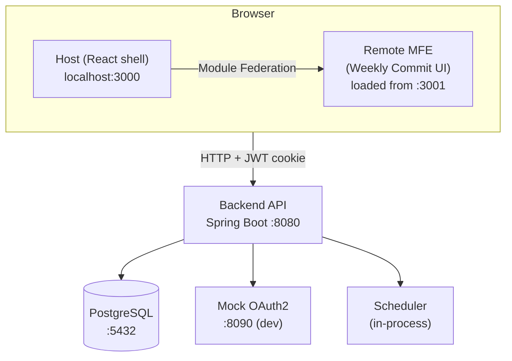
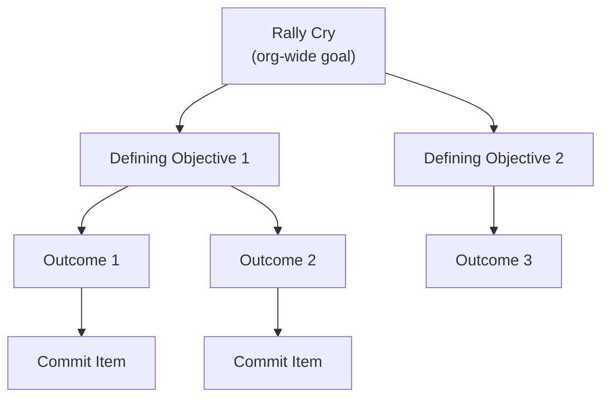
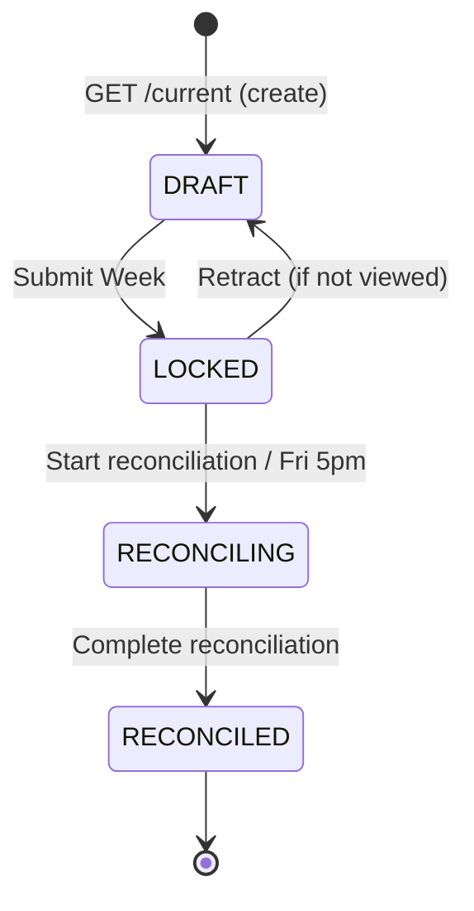
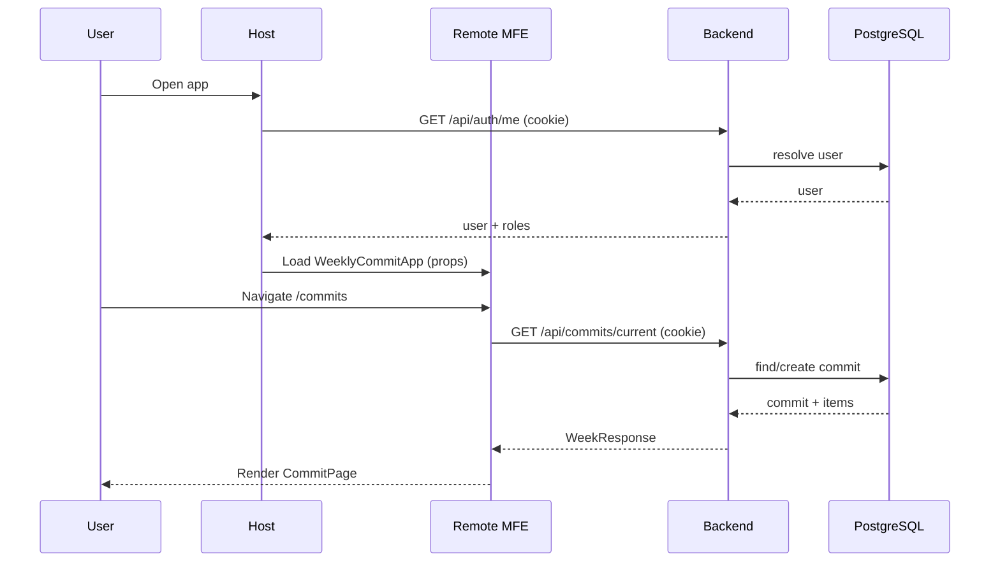

# Weekly Commit Module — Architecture & Product Overview

This document describes the **system architecture**, **component responsibilities**, and **product functionality** of the Weekly Commit Module. It is intended for engineers and product stakeholders who need a single reference for how the system is built and what it does.

---

## 1. System Overview

The **Weekly Commit Module** is an internal micro-frontend that replaces 15-Five. It enforces **strategic alignment** between weekly work and organizational goals using:

- **RCDO hierarchy** (Rally Cry → Defining Objectives → Outcomes), grounded in Patrick Lencioni’s *The Advantage*
- **Chess layer** for prioritization (King/Queen/Rook/Bishop/Knight/Pawn)
- **Commit lifecycle** with a strict state machine (DRAFT → LOCKED → RECONCILING → RECONCILED) to prevent “revisionist history” and support accountability

The system answers Lencioni’s **Questions 5 & 6**: *What is most important, right now?* (RCDO + Chess) and *Who must do what?* (Manager Dashboard and reconciliation).

**Target users:** Employees (ICs) and Managers within a single organization. A user can hold both roles (dual role).

---

## 2. High-Level Architecture

### 2.1 Runtime Topology

```
┌─────────────────────────────────────────────────────────────────────────┐
│ Browser                                                                  │
│   ┌─────────────────────────────────────────────────────────────────┐  │
│   │ Host (React shell) — localhost:3000                               │  │
│   │   • Auth gate: /auth/me → redirect to OAuth or render remote      │  │
│   │   • Loads remote via Module Federation                             │  │
│   │   └── Remote MFE (Weekly Commit UI) — loaded from localhost:3001  │  │
│   │         • /commits, /history, /manager, /manager/strategy, etc.  │  │
│   └─────────────────────────────────────────────────────────────────┘  │
└─────────────────────────────────────────────────────────────────────────┘
         │
         │ HTTP + credentials (JWT cookie)
         ▼
┌─────────────────────────────────────────────────────────────────────────┐
│ Backend API — localhost:8080                                             │
│   • Spring Boot 3 / Java 21 REST API                                     │
│   • /api/* — JWT required (except /api/health, /api/auth/logout)         │
│   • /oauth2/** , /login/** — OAuth2 flow                                 │
└─────────────────────────────────────────────────────────────────────────┘
         │
         ├──────────────────────┬────────────────────────────┐
         ▼                      ▼                            ▼
┌─────────────────┐   ┌─────────────────┐   ┌─────────────────────────────┐
│ PostgreSQL      │   │ Mock OAuth2     │   │ Scheduler (in-process)      │
│ localhost:5432  │   │ localhost:8090  │   │ Mon 6am UTC: ensure DRAFTs  │
│ (Docker: 5432)  │   │ (dev only)      │   │ Fri 5pm UTC: LOCKED→RECONC  │
└─────────────────┘   └─────────────────┘   └─────────────────────────────┘
```

### 2.2 Monorepo Layout

| Path | Purpose |
|------|--------|
| `ci_pm/` | Module root (Weekly Commit Module) |
| `backend/` | Java 21 / Spring Boot 3 REST API |
| `remote/` | React 18 + Vite MFE (weekly commit UI), exposed via Module Federation |
| `host/` | React 18 + Vite shell that loads the remote and provides auth gate |
| `docs/` | PRD, API, schema, THE_ADVANTAGE, assumptions, etc. |

### 2.3 Mermaid Diagrams

#### System topology



#### RCDO hierarchy



#### Commit state machine



#### Request flow (authenticated API)



#### Backend package dependencies

```mermaid
flowchart LR
  subgraph API["API Layer"]
    Auth["AuthController"]
    RcDo["RcDoController"]
    Commit["CommitController"]
    Manager["ManagerController"]
    ManagerRcDo["ManagerRcdoController"]
  end

  subgraph Services["Service Layer"]
    CommitSvc["CommitService"]
    StateSvc["StateMachineService"]
    RcDoSvc["RcDoService"]
    RcDoAdmin["RcdoAdminService"]
    ManagerSvc["ManagerService"]
  end

  subgraph Data["Data Layer"]
    Repos["Repositories"]
    DB[(PostgreSQL)]
  end

  API --> Services
  Services --> Repos
  Repos --> DB
```



---

## 3. Component Deep Dive

### 3.1 Backend (Java / Spring Boot)

**Location:** `backend/`

**Responsibilities:**

- **REST API** — All business operations go through controllers; no direct DB access from frontend.
- **Auth** — OAuth 2.0 Authorization Code flow with an external provider; backend exchanges code for tokens, finds or creates user, issues **internal JWT** (HS256) in an httpOnly cookie. All `/api/*` (except health/logout) require this JWT.
- **State machine** — Only valid commit status transitions (DRAFT→LOCKED, LOCKED→DRAFT retract, LOCKED→RECONCILING, RECONCILING→RECONCILED) are allowed; each transition is logged immutably to `state_transitions`.
- **Scheduler** — `WeeklyCommitScheduler`: Monday 6am UTC ensures current-week DRAFT for all users; Friday 5pm UTC moves LOCKED commits to RECONCILING.
- **Org scoping** — Every query is scoped by `org_id` from the JWT; no cross-org data access.

**Package structure:**

| Package | Role |
|---------|------|
| `controller/` | REST endpoints: Auth, RcDo, Commit, Manager, ManagerRcdo, Health |
| `service/` | Business logic: CommitService, StateMachineService, RcDoService, RcdoAdminService, ManagerService |
| `repository/` | JPA repositories for all entities |
| `model/` | JPA entities (User, Organization, RallyCry, DefiningObjective, Outcome, WeeklyCommit, CommitItem, StateTransition, ManagerNote, etc.) |
| `dto/` | Request/response DTOs; entities are never exposed directly |
| `security/` | JwtService, JwtAuthFilter, OAuthUserService, OAuthSuccessHandler |
| `config/` | SecurityConfig, CORS, session policy |
| `scheduler/` | WeeklyCommitScheduler |
| `exception/` | GlobalExceptionHandler, domain exceptions (e.g. InvalidStateTransitionException) |

**Database:** PostgreSQL 15. Schema and seed data are managed by **Flyway** migrations under `backend/src/main/resources/db/migration/` (V1 initial schema, V2 indexes, V3 seed, plus later migrations for unplanned items, outcome types, etc.).

---

### 3.2 Remote MFE (React / Vite)

**Location:** `remote/`

**Responsibilities:**

- **Weekly Commit UI** — All user-facing flows: current commit, history, reconciliation, manager dashboard, strategy (RCDO admin), pivot radar, manager notes, etc.
- **Module Federation** — Exposes a single entry: `./WeeklyCommitApp`. Consumed by the host at runtime via `remoteEntry.js` (e.g. `http://localhost:3001/assets/remoteEntry.js`).
- **Routing** — Uses **MemoryRouter** (React Router) so navigation is in-memory only and does not change the host’s URL; required for embedding inside another app.
- **State** — **Zustand** for client state (e.g. auth store); **React Query** for server state (commits, RCDO, team, etc.).
- **UI** — shadcn/ui components; **@dnd-kit/core** for drag-and-drop (e.g. reorder items within same chess piece).

**Key entry:** `WeeklyCommitApp.tsx` — Receives `userId`, `orgId`, `authToken` (semantic; actual auth is cookie), `onAuthExpired`, and optional `activeRallyCryId`. Renders `AppNav` and routes:

| Route | Page | Purpose |
|-------|------|--------|
| `/` | RoleRedirect | Redirects to `/manager` (manager) or `/commits` (IC) |
| `/commits` | CommitPage | Current week commit (add/edit items, submit, retract, reconcile) |
| `/commits/:id` | CommitDetailPage | Single commit detail (e.g. past week or team member) |
| `/history` | CommitHistoryPage | Paginated past commits |
| `/manager` | ManagerDashboard | Team status, alignment, pivot radar, drill into member commits |
| `/manager/strategy` | StrategyPage | RCDO admin (Rally Cries, Defining Objectives, Outcomes, owners) |
| `/resources` | ResourcesPage | Resources |
| `/board` | BoardPage | Strategic board view |

**API access:** `api/client.ts` — Centralized `fetch` wrapper with `credentials: 'include'`, 401 handling (calls `onAuthExpired`), and typed methods for auth, rcdo, commits, manager (including manager.rcdo for strategy).

---

### 3.3 Host (React / Vite)

**Location:** `host/`

**Responsibilities:**

- **Auth gate** — On load, calls `GET /api/auth/me` with credentials. If unauthenticated, shows a “Sign In” page with link to `GET /oauth2/authorization/oidc` (backend redirects to OAuth provider). After login, backend redirects back to host with JWT cookie set.
- **Embed remote** — Once user is known, renders `WeeklyCommitApp` via dynamic import `weeklyCommitModule/WeeklyCommitApp` with `userId`, `orgId`, `authToken="cookie"`, `onAuthExpired` (redirect to OAuth), and optional `activeRallyCryId`.
- **Shell UI** — Simple header with app name, user email, and Sign Out (POST /api/auth/logout then full reload or redirect).

**Module Federation:** Host declares `weeklyCommitModule` as a remote with URL from `REMOTE_URL` (e.g. `http://localhost:3001/assets/remoteEntry.js`), set at build time (e.g. Docker ARG).

---

### 3.4 Database (PostgreSQL)

**Core entities:**

- **organizations** — Org name, alignment_threshold (e.g. 70).
- **users** — org_id, email, full_name, oauth_subject, manager_id (self-reference for reporting).
- **user_roles** — (user_id, role) with role in ('EMPLOYEE','MANAGER'); dual role = two rows.
- **rally_cries** — org_id, title, description, active.
- **defining_objectives** — rally_cry_id, title, description, active.
- **outcomes** — defining_objective_id, owner_id (user), title, description, active.
- **weekly_commits** — user_id, org_id, week_start_date, status (DRAFT|LOCKED|RECONCILING|RECONCILED), viewed_at, locked_at, reconciling_at, reconciled_at, total_locked_weight (snapshot when locked).
- **commit_items** — weekly_commit_id, outcome_id, title, description, chess_piece, chess_weight, priority_order, actual_outcome, completion_status, carry_forward, carry_forward_count, carried_from_id, unplanned, bumped_item_id.
- **state_transitions** — weekly_commit_id, from_state, to_state, transitioned_by, transitioned_at, notes (immutable audit log).
- **manager_notes** — weekly_commit_id, manager_id, note.

**Indexes** — On (user_id, week_start_date), (org_id, status), commit_items by commit/outcome/chess_weight, state_transitions by commit, users by org/manager/oauth_subject, RCDO hierarchy FKs.

---

### 3.5 Authentication & Authorization

- **Flow:** Browser → GET `/oauth2/authorization/oidc` → redirect to OAuth provider → user logs in → redirect to `/login/oauth2/code/oidc` with code → backend exchanges code, loads OIDC user, uses `OAuthUserService` to find-or-create user by `oauth_subject`, assigns roles from `user_roles`, then `OAuthSuccessHandler` issues internal JWT and sets httpOnly cookie, redirects to frontend (e.g. host).
- **JWT:** Contains userId, orgId, roles, expiry; signed with HS256. Stored in httpOnly, Secure, SameSite cookie; never in localStorage.
- **RBAC:** `/api/manager/**` requires MANAGER or DUAL_ROLE; all other `/api/**` require authenticated user. Org scoping is enforced in services via JWT orgId.

---

## 4. Product Functionality Summary

### 4.1 RCDO Hierarchy

- **Rally Cry** — Single most important org priority (e.g. “Achieve product-market fit in SMB segment”).
- **Defining Objectives** — Team-level categories under a Rally Cry (e.g. “Ship 3 customer-requested features by Q3”).
- **Outcomes** — Individual-level measurable results under a Defining Objective; each has an owner. Commit items link to **exactly one** Outcome, so every item traces up to one Rally Cry.

Managers use **Strategy** (`/manager/strategy`) to create/edit/deactivate Rally Cries, Defining Objectives, and Outcomes and to assign outcome owners. ICs pick an Outcome when adding a commit item; the UI shows full breadcrumb (Rally Cry › Objective › Outcome).

### 4.2 Chess Layer

Each commit item has a **chess piece** (KING=100, QUEEN=80, ROOK=60, BISHOP=40, KNIGHT=20, PAWN=10). Items are ordered by weight; drag-and-drop allows reordering within the same piece. Weekly weight summary and alignment score (for managers) are derived from these weights. Soft warning if no King or Queen.

### 4.3 Commit Lifecycle (State Machine)

- **DRAFT** — Auto-created (e.g. Monday scheduler or first GET current). IC can add/edit/delete items. Submit → LOCKED (validated: at least one item, all items have outcome + chess piece).
- **LOCKED** — Items immutable. IC can retract → DRAFT only if manager has not yet viewed (`viewed_at` is null). Otherwise, IC or Friday 5pm scheduler can move to RECONCILING.
- **RECONCILING** — IC sets completion status (COMPLETED/PARTIAL/NOT_COMPLETED) and optional actual outcome and carry-forward per item; then “Complete reconciliation” → RECONCILED.
- **RECONCILED** — Read-only; reconciliation summary and carry-forwards are fixed.

All transitions are validated on the backend and logged to `state_transitions`.

### 4.4 Key User Flows

- **IC:** Plan week (add items with outcome + chess piece, reorder) → Submit Week → (optional) Retract before manager views → Start reconciliation → Set completion/carry-forward → Complete reconciliation; view History; add Unplanned item (mid-week pivot) when LOCKED/RECONCILING (specify which item is bumped).
- **Manager:** Strategy — maintain RCDO and outcome owners; My Team — dashboard with status, alignment, pivot radar; open a report’s commit (sets viewed_at, disables retract); add manager notes; see planned vs actual after reconciliation.
- **Dual role:** Same login; nav shows both IC (My Week, History) and Manager (My Team, Strategy) entry points.

### 4.5 Alignment & Reporting

- **Alignment score** — Sum of weights of RCDO-linked items / total weight; below org threshold (e.g. 70%) surfaces a misalignment warning on the manager dashboard.
- **Pivot Radar** — Unplanned items (and bumped items) in the last N weeks for visibility.
- **Carry-forward** — Incomplete items can be carried to the next week; carried count and source are tracked for accountability.

---

## 5. Integration Points

- **Host ↔ Remote:** Module Federation; host passes props into `WeeklyCommitApp` and receives no direct callbacks except `onAuthExpired`.
- **Frontend ↔ Backend:** REST over HTTP; JWT sent via cookie; CORS allows host and remote origins with credentials.
- **Backend ↔ PostgreSQL:** JDBC; Spring Data JPA.
- **Backend ↔ OAuth provider:** OAuth 2.0 Authorization Code; local dev uses mock OAuth2 server (Docker); production would use a real IdP (e.g. Okta, Auth0).

---

## 6. Deployment & CI/CD

- **Docker Compose (dev):** `postgres`, `mock-oauth2`, `backend`, `remote`, `host`; env from `.env` (see `.env.example`). Host depends on remote; backend depends on postgres and mock-oauth2.
- **CI (GitHub Actions):** On push/PR to `main`: build and test backend (Maven), build and test remote and host (npm ci + npm test), and Docker build for backend, remote, and host. No deployment step in the provided workflow.

---

## 7. Technology Stack Summary

| Layer | Technology |
|-------|------------|
| Backend | Java 21 (virtual threads), Spring Boot 3.2.x |
| Database | PostgreSQL 15, Flyway |
| Auth | OAuth 2.0 Authorization Code, internal JWT (HS256), httpOnly cookie |
| Frontend | TypeScript (strict), React 18, Vite |
| MFE | Module Federation (@originjs/vite-plugin-federation) |
| Client state | Zustand |
| Server state | React Query |
| UI | shadcn/ui |
| Drag-and-drop | @dnd-kit/core |
| Backend tests | JUnit 5, Mockito |
| Frontend tests | Vitest, React Testing Library |
| Containers | Docker, Docker Compose |

---

## 8. Document Cross-References

- **Product & strategy:** [PRD.md](PRD.md), [THE_ADVANTAGE.md](THE_ADVANTAGE.md), [ASSUMPTIONS.md](ASSUMPTIONS.md)
- **API:** [API.md](API.md)
- **Data model:** [SCHEMA.sql](SCHEMA.sql)
- **Development:** [README.md](../README.md), [CLAUDE.md](CLAUDE.md), [TDD.md](TDD.md)
